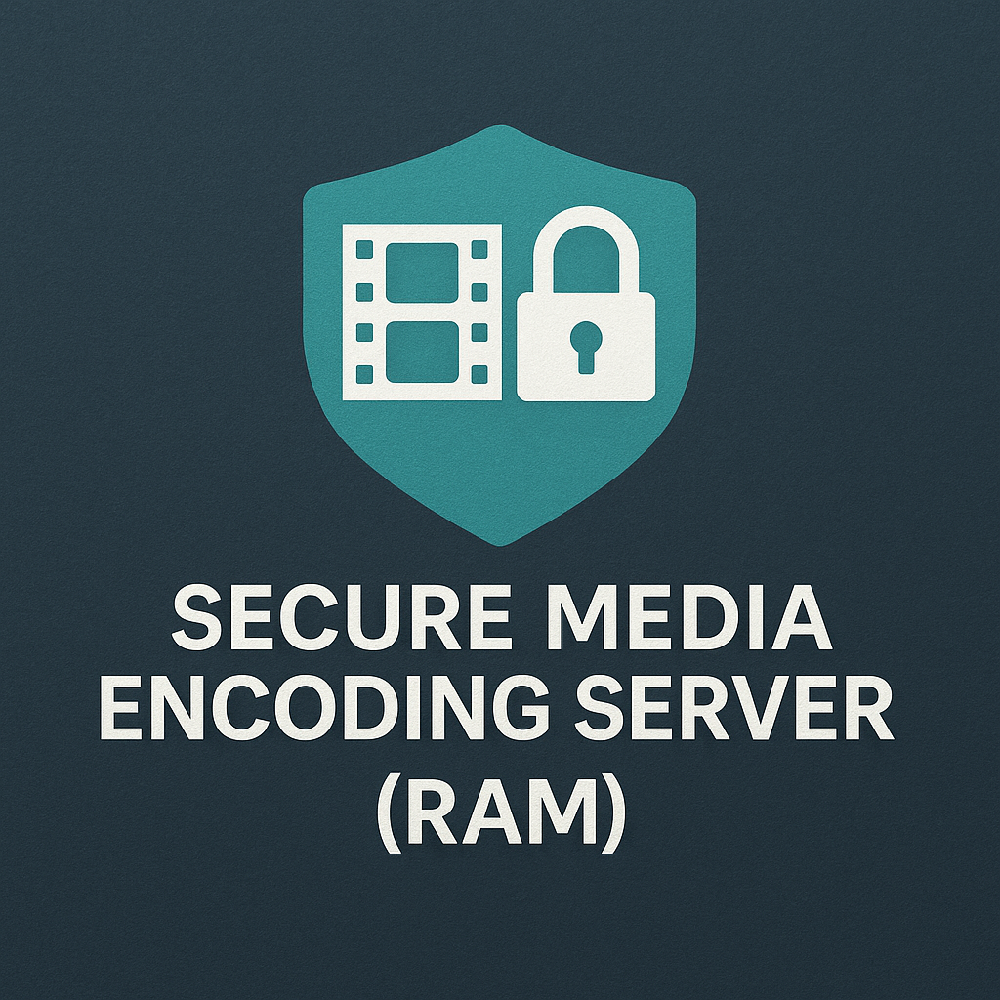

# Secure Media Encoding Server (RAM)



**A zero-trust, privacy-first media processing infrastructure with dual-mode encryption**

[](.)
[](.)
[](.)
[](./LICENSE.txt)

## Overview

This project was born out of necessity, as a way to deploy a secure and private encoding server to untrusted environments: I have a lot of old media of my family, pictures and videos, VHS digitalized media, that need a lot of resources to be encoded entirely, yet I don't want to leak my personal information to the public.

It can be a very interesting Homelab project, and I hope other devs will be willing to improve it and extend the functionality.

The encoding server runs on a minimal and efficient Docker container, making it more versatile and robust, and despite its simplicity has some very effective enterprise grade security features, using a dual-mode encryption approach that provides complete transparency to end users while maintaining zero-trust security principles.

## Key Features

### 🔐 **Dual-Mode Encryption Architecture**
- **Automated Mode**: Users interact exclusively with unencrypted media while server transparently handles all cryptographic operations
- **Manual Mode**: Client-controlled encryption where the user provides the already encrypted file securely to the server (useful on compromised clients)
- **Batch Processing**: Fully fledged folder encryption/decryption with recursive processing and integrity verification

### 🛡️ **Enterprise Grade Security**
- **HTTPS-Only Operation**: Complete TLS certificate lifecycle management
- **2024-2025 Threat Protection**: Enhanced Seccomp profiles protecting against IO_URING vulnerabilities, container escapes, and process injection attacks
- **Layered Container Security**: Advanced AppArmor + Seccomp + Linux capability restrictions (NOTE: If deploying in another container like LXC, it is suggested to let the outer container manage AppArmor)
- **Docker Secrets Integration**: Zero hardcoded secrets with centralized SecretManager system
- **Password Security**: Complete elimination of password exposure with encrypted Redis storage

### 🏗️ **Proxmox-Native Architecture**
- **Docker-in-LXC Deployment**: Simple single container approach that is designed to work out of the box on Proxmox LXCs
- **Alpine Linux Base**: Minimal attack surface with maximum security hardening
- **ZFS Integration**: Native encryption support for temporary processing
- **Resource Optimization**: 48GB RAM, 8+ cores recommended for optimal performance

### ⚡ **High-Performance Processing**
- **21 API Endpoints**: 12 processing + 9 comprehensive documentation endpoints
- **Real-Time Progress Monitoring**: Frame-level accuracy FFmpeg tracking
- **Comprehensive Job Management**: Full lifecycle control including graceful cancellation
- **Redis-Based Queue**: Distributed job coordination with session state persistence

## Quick Start

### Prerequisites
- Proxmox VE 8.0+ (for production deployment)
- Docker and Docker Compose (for development)
- Python 3.11+
- 48GB RAM and 8+ CPU cores (recommended)

### Development Setup
```bash
# Clone the repository
git clone <repository-url>
cd encoding-server

# Start secure environment
make secure-build && make secure-up

# Run comprehensive tests
make test-all

# Access API documentation
curl https://localhost:8443/v1/docs
```

### Production Deployment
```bash
# Build and deploy with Docker-in-LXC
make secure-build
make secure-up
```

The MakeFile architecture is centralized and can be used as a control panel to run tests, deploy and stop the container. Is it meant for those who are not practical with Docker containers.

### Docker Compose Configuration

The `docker-compose.secure.yml` file can be adapted to your specific needs:

```yaml
# Key configuration areas to customize:
environment:
  - LOG_LEVEL=INFO          # Change to DEBUG for development
  - MAX_WORKERS=4           # Adjust based on CPU cores
  - MAX_FILE_SIZE=2GB       # Set upload limits
  - SESSION_TIMEOUT=3600    # API session timeout

volumes:
  - ./uploads:/app/uploads          # Custom upload directory
  - ./results:/app/results          # Custom output directory
  - ./certificates:/app/certs       # TLS certificate location

ports:
  - "8443:8443"            # HTTPS port (change external port as needed)
```

## Quick Start Examples

### Basic File Processing
```bash
# Submit a video for encoding (automated mode)
curl -X POST https://localhost:8443/v1/jobs \
  -H "Content-Type: multipart/form-data" \
  -F "file=@video.mp4" \
  -F "params=-c:v libx264 -crf 23"

# Check job status
curl https://localhost:8443/v1/jobs/{job_id}

# Download result
curl https://localhost:8443/v1/jobs/{job_id}/result -o encoded_video.mp4
```

### Using Client Tools
```bash
# Manual mode: encrypt first, then submit
python client-tools/encrypt_media.py input.mp4 encrypted.enc
curl -X POST https://localhost:8443/v1/jobs \
  -F "file=@encrypted.enc" \
  -F "mode=manual" \
  -F "params=-c:v libx265 -crf 28"

# Batch processing entire directories
python client-tools/batch_encrypt.py /path/to/media/folder
```

## Frontend Integration

This server is designed as a backend-only solution that integrates seamlessly with any frontend framework. The comprehensive REST API with JSON responses makes it compatible with:

- **Web Applications**: React, Vue.js, Angular
- **Mobile Apps**: Native iOS/Android, React Native, Flutter  
- **Desktop Applications**: Electron, Tauri, native desktop apps
- **Command Line Tools**: Custom scripts using curl or HTTP clients

The Unix ManPage-style API documentation at `/v1/docs` provides all necessary endpoints and examples for frontend integration.

## Architecture Overview

### Core Components
- **FastAPI Server**: High-performance asynchronous API operations
- **Redis**: Distributed job queue and encrypted key storage
- **FFmpeg**: Media processing with security sandboxing
- **SecretManager**: Centralized Docker secrets integration

### Security Architecture
- **Transport Security**: HTTPS-only with complete certificate management
- **Container Security**: AppArmor, Seccomp, and capability restrictions
- **Secret Management**: Enterprise-grade Docker secrets with encrypted storage
- **Process Isolation**: Complete sandboxing with proven threat protection

## API Documentation

The server provides comprehensive Unix ManPage-style documentation:
- `/v1/docs` - Documentation index with navigation
- `/v1/docs/overview` - System overview and quick start
- `/v1/docs/modes` - Dual-mode encryption guide
- `/v1/docs/endpoints` - Complete API reference
- `/v1/docs/examples` - Workflow examples with curl commands

## Client Tools

### Encryption Tools
- `encrypt_media.py` - Single file encryption with secure password input
- `decrypt_media.py` - Single file decryption with integrity verification
- `batch_encrypt.py` - Recursive folder encryption with parallel processing
- `batch_decrypt.py` - Complete directory structure restoration

### Workflow Helpers
- `secure_submit.py` - Complete secure job submission pipeline
- `progress_monitor.py` - Real-time job progress tracking

## Project Structure

```
├── api/                    # FastAPI server implementation
│   ├── app/               # Core application logic
│   ├── config/            # Configuration management
│   └── documentation/     # API documentation system
├── client-tools/          # Encryption/decryption utilities
├── security/              # AppArmor and Seccomp profiles
├── scripts/               # Deployment and utility scripts
├── tests/                 # Comprehensive test suite
├── certificates/          # TLS certificate management
└── docker-compose.secure.yml  # Production deployment
```

## Testing

Comprehensive test suite achieving 96.2% success rate:
```bash
# Run all tests
make test-all

# Specific test categories
make test-unit          # Unit tests (17/17 passing)
make test-security      # Security validation
make test-encryption    # Dual-mode encryption tests
make test-cancellation  # Job cancellation system
make test-docs          # API documentation validation
```
The testing suite has been developed using Claude Code + GPT5 coding utilities, and should cover most of the functionality. It can also be used as the base structure to learn how to use the API Endpoints.

## Security Features

- **Maximum Security Posture**: 95.87% quality score metric by Claude Code security analysis
- **Enterprise Certificate Management**: Automated provisioning and renewal
- **Comprehensive Password Security**: Multi-layer protection eliminating CLI exposure
- **Real-Time Threat Protection**: Enhanced profiles against latest vulnerabilities
- **Zero Functional Degradation**: Security implementations maintain full compatibility

## Additional Features

- **Auto Secrets Shredding**: Automatic secure memory cleanup with secrets overwritten and cleared after use
- **Intelligent Secret Management**: Multi-fallback system (Docker secrets → tmpfs → local development)
- **Secure File Deletion**: Military-grade file shredding for temporary processing files
- **Memory Pool Protection**: Encrypted tmpfs mounts for sensitive data processing
- **Health Monitoring**: Real-time system health checks with encrypted status reporting
- **Graceful Degradation**: System remains functional even with partial security feature failures
- **TTL-Based Cleanup**: Automatic cleanup of encrypted keys and temporary data with time-to-live expiration

## Contributing

This project follows enterprise-grade development practices:
- Black code formatting (88-character line length)
- Comprehensive docstring coverage (Google-style)
- Pre-commit hooks for security scanning
- Atomic, descriptive commits with proper attribution

## License

This project is licensed under the GNU Affero General Public License v3.0 (AGPL-3.0) - see the [LICENSE.txt](LICENSE.txt) file for details.

## Attribution

**Author**: Lorenzo Albanese (alblor)  
**Owner**: Lorenzo Albanese (alblor)  
**Version**: 1.0.0  
**Architecture**: Python backend with Redis and FastAPI

---

For detailed technical documentation, deployment procedures, and architectural decisions, refer to the corresponding API Endpoints.

---

DISCLAMER: I am not responsible for inappropriate uses of the provided software and tools. It is provided as-is.